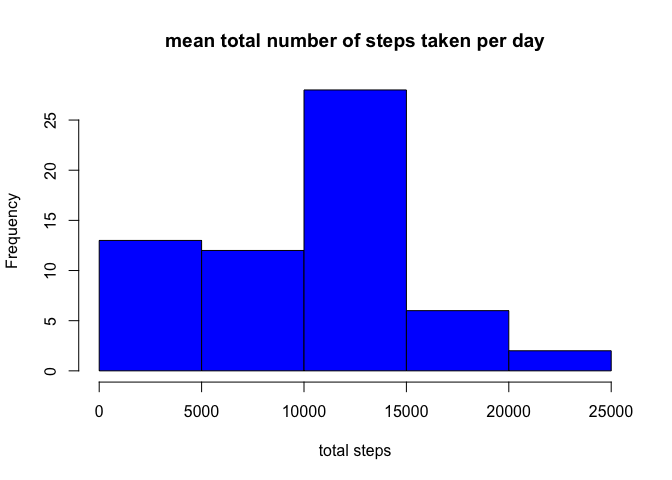
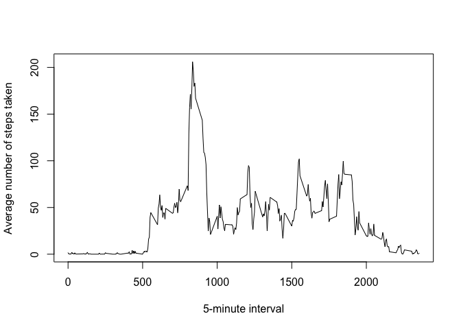
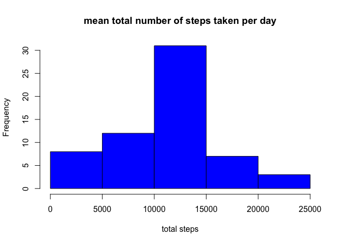
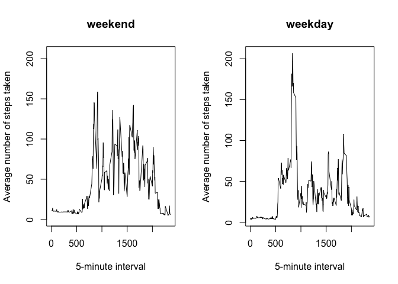

# Reproducible Research: Peer Assessment 1


## Loading and preprocessing the data
First, I load the "activity" dataset and change the data format to what we need. We can get a glance of the data.


```r
data<-read.csv('activity.csv',colClasses=c('numeric','Date','numeric'))
head(data)
```

```
##   steps       date interval
## 1    NA 2012-10-01        0
## 2    NA 2012-10-01        5
## 3    NA 2012-10-01       10
## 4    NA 2012-10-01       15
## 5    NA 2012-10-01       20
## 6    NA 2012-10-01       25
```

## What is mean total number of steps taken per day?
Using "tapply" method, we can easily get the total number of steps taken per day.


```r
st_sum<-tapply(data$steps,data$date,sum,na.rm=TRUE)
hist(st_sum,col='blue',main="mean total number of steps taken per day",xlab="total steps")
```

 

```r
m1<-mean(st_sum)
m2<-median(st_sum)
```
As we can see, the mean total number of steps taken per day is 9354.2295082, and its median is 1.0395\times 10^{4}. But from its histogram, there are a lot of small values, since we have a lot of missing value

## What is the average daily activity pattern?
Similarly, we can find the average daily activity pattern, and we can find that the plot reach to the top when 5-minute interval around 900.


```r
st_mean<-tapply(data$steps,data$interval,mean,na.rm=TRUE)
x<-data$interval[1:288]
plot(x,st_mean,type='l',xlab='5-minute interval',ylab='Average number of steps taken')
```

 

## Imputing missing values
To inpute the missing values, I use the mean for that 5-minute interval for any missing step. And repeat the step in question 1.


```r
miss<-sum(is.na(data))
index<-which(is.na(data))
df<-data.frame(interval=x,mean=st_mean)
u=merge(df,data[index,],by='interval')
data$steps[index]<-u$mean
st_sum2<-tapply(data$steps,data$date,sum,na.rm=TRUE)
hist(st_sum2,col='blue',main="mean total number of steps taken per day",xlab="total steps")
```

 

```r
m3<-mean(st_sum2)
m4<-median(st_sum2)
```

We can find that the new histogram is more normalized. And the new mean total number of steps taken per day is 1.0766189\times 10^{4}, and its new median is 1.1015\times 10^{4}.


## Are there differences in activity patterns between weekdays and weekends?
To get the differences in activity patterns between weekdays and weekends, I first split our dataset into two subset by 'weekend' and 'weekday'. And find the activity patterns using the method in question 2, respectively.


```r
library(dplyr)
```

```
## 
## Attaching package: 'dplyr'
## 
## The following object is masked from 'package:stats':
## 
##     filter
## 
## The following objects are masked from 'package:base':
## 
##     intersect, setdiff, setequal, union
```

```r
library(timeDate)
newdata<-mutate(data,week=factor(isWeekday(date)))
levels(newdata$week)<-c('weekend','weekday')
sub1<-subset(newdata,week=='weekend')
sub2<-subset(newdata,week=='weekday')
st_mean2<-tapply(sub1$steps,sub1$interval,mean)
st_mean3<-tapply(sub2$steps,sub2$interval,mean)
par(mfrow=c(1,2))
plot(st_mean2~x,type='l',xlab='5-minute interval',ylab='Average number of steps taken',ylim=c(0,max(st_mean3)),main='weekend')
plot(st_mean3~x,type='l',xlab='5-minute interval',ylab='Average number of steps taken',main='weekday')
```

 

From our result, the Average number of steps taken in weekday has greater maximum value and more fluctuating.

